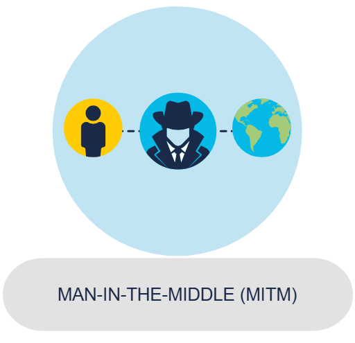
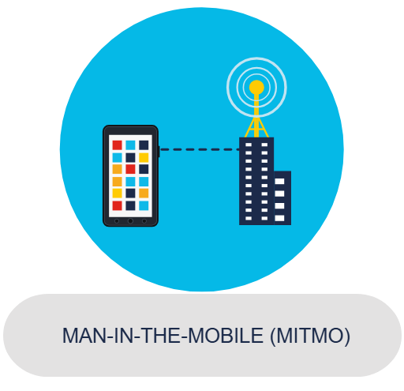

## Analyzing a Cyber Attack

# Types of malware
Cybercriminals use many different types of malicious software, or malware, to carry out their activities. Malware is any code that can be used to steal data, bypass access controls, or cause harm to or compromise a system. Knowing what the different types are and how they spread is key to containing and removing them.

# Most common Malware
1. Spyware

Designed to track and spy on you, spyware monitors your online activity and can log every key you press on your keyboard, as well as capture almost any of your data, including sensitive personal information such as your online banking details. Spyware does this by modifying the security settings on your devices.

It often bundles itself with legitimate software or Trojan horses.
Legitimate software = Software that is genuine, legal, and safe to use

2. Adware

Adware is often installed with some versions of software and is designed to automatically deliver advertisements to a user, most often on a web browser. You know it when you see it! It’s hard to ignore when you’re faced with constant pop-up ads on your screen.

It is common for adware to come with spyware.

3. Backdoor

This type of malware is used to gain unauthorized access by bypassing the normal authentication procedures to access a system. As a result, hackers can gain remote access to resources within an application and issue remote system commands.

A backdoor works in the background and is difficult to detect.

4. Ransomware

This malware is designed to hold a computer system or the data it contains captive until a payment is made. Ransomware usually works by encrypting your data so that you can’t access it.

Some versions of ransomware can take advantage of specific system vulnerabilities to lock it down. Ransomware is often spread through phishing emails that encourage you to download a malicious attachment or through a software vulnerability.

5. Scareware

This is a type of malware that uses 'scare’ tactics to trick you into taking a specific action. Scareware mainly consists of operating system style windows that pop up to warn you that your system is at risk and needs to run a specific program for it to return to normal operation.

If you agree to execute the specific program, your system will become infected with malware.

6. Rootkit

This malware is designed to modify the operating system to create a backdoor, which attackers can then use to access your computer remotely. Most rootkits take advantage of software vulnerabilities to gain access to resources that normally shouldn’t be accessible (privilege escalation) and modify system files.

Rootkits can also modify system forensics and monitoring tools, making them very hard to detect. In most cases, a computer infected by a rootkit has to be wiped and any required software reinstalled.

7. Virus

A virus is a type of computer program that, when executed, replicates and attaches itself to other executable files, such as a document, by inserting its own code. Most viruses require end-user interaction to initiate activation and can be written to act on a specific date or time.

Viruses can be relatively harmless, such as those that display a funny image. Or they can be destructive, such as those that modify or delete data.

Viruses can also be programmed to mutate in order to avoid detection. Most viruses are spread by USB drives, optical disks, network shares or email.

8. Trojan horse

This malware carries out malicious operations by masking its true intent. It might appear legitimate but is, in fact, very dangerous. Trojans exploit your user privileges and are most often found in image files, audio files or games.

Unlike viruses, Trojans do not self-replicate but act as a decoy to sneak malicious software past unsuspecting users.

9. Worms

This is a type of malware that replicates itself in order to spread from one computer to another. Unlike a virus, which requires a host program to run, worms can run by themselves. Other than the initial infection of the host, they do not require user participation and can spread very quickly over the network.

Worms share similar patterns: They exploit system vulnerabilities, they have a way to propagate themselves, and they all contain malicious code (payload) to cause damage to computer systems or networks.

Worms are responsible for some of the most devastating attacks on the Internet. In 2001, the Code Red worm had infected over 300,000 servers in just 19 hours.

## Sypmtoms of Malware
Regardless of the type of malware a system has been infected with, there are some common symptoms to look out for. These include:
i. an increase in CPU usage, which slows down your device
ii. your computer freezing or crashing down
iii. a decrease in your web browsing speed
iv. unexplainable problems with your network connections
v. modified or deleted files
vi. the presence of unknown files, programs or desktop icons
vii. unknown processes running
viii. programs turning off or reconfiguring themselves
ix. emails being sent without your knowledge or consent.

## Methods of Infilteration
Infiltration is how attackers gain unauthorized access to a system, network, or device  often by bypassing defenses stealthily.

1. Social Engineering

Social engineering is the manipulation of people into performing actions or divulging confidential information. Social engineers often rely on people’s willingness to be helpful, but they also prey on their weaknesses. 

For example, an attacker will call an authorized employee with an urgent problem that requires immediate network access and appeal to the employee’s vanity or greed or invoke authority by using name-dropping techniques in order to gain this access.

i. Pretexting

 This is when an attacker calls an individual and lies to them in an attempt to gain access to privileged data.
For example, pretending to need a person’s personal or financial data in order to confirm their identity.

ii. Tailgating

 This is when an attacker quickly follows an authorized person into a secure, physical location.

iii. Something for something (quid pro quo)

 This is when an attacker requests personal information from a person in exchange for something, like a free gift.

2. Denial-of-Service

Denial-of-Service (DoS) attacks are a type of network attack that is relatively simple to carry out, even by an unskilled attacker. A DoS attack results in some sort of interruption of network service to users, devices or applications.

# Two main types of DoS attack
i. Overwhelming quality of traffic

This is when a network, host or application is sent an enormous amount of data at a rate which it cannot handle. This causes a slowdown in transmission or response, or the device or service to crash.

ii. Maliciously formatted packets

A packet is a collection of data that flows between a source and a receiver computer or application over a network, such as the internet. When a maliciously formatted packet is sent, the receiver will be unable to handle it.

foreg: If an attacker forwards packets containing errors or improperly formatted packets that cannot be identified by an application, this will cause the receiving device to run very slowly or crash.

DoS attacks are considered a major risk because they can easily interrupt communication and cause significant loss of time and money.

 3. Distributed DoS
 
 A Distributed DoS (DDoS) attack is similar to a DoS attack but originates from multiple, coordinated sources. For example:

An attacker builds a network (botnet) of infected hosts called zombies, which are controlled by handler systems.
The zombie computers will constantly scan and infect more hosts, creating more and more zombies.
When ready, the hacker will instruct the handler systems to make the botnet of zombies carry out a DDoS attack.

4. Botnet
A bot computer is typically infected by visiting an unsafe website or opening an infected email attachment or infected media file. A botnet is a group of bots, connected through the Internet, that can be controlled by a malicious individual or group. It can have tens of thousands, or even hundreds of thousands, of bots that are typically controlled through a command and control server.

These bots can be activated to distribute malware, launch DDoS attacks, distribute spam email, or execute brute-force password attacks. Cybercriminals will often rent out botnets to third parties for nefarious purposes.

Many organizations. like Cisco, force network activities through botnet traffic filters to identify any botnet locations.

i. Infected bots try to communicate with a command and control host on the internet.
ii. The Cisco Firewall botnet filter is a feature that detects traffic coming from devices infected with the malicious botnet code.
iii. The cloud-based Cisco Security Intelligence Operation (SIO) service pushes down updated filters to the firewall that match traffic from new known botnets.
iv. Alters go out to Cisco's internal security team to notify them about the infected devices that are generating malicious traffic so that they can prevent, mitigate and remedy these.

5. On-path attack
On-path attackers intercept or modify communications between two devices, such as a web browser and a web server, either to collect information from or to impersonate one of the devices.

This type of attack is also referred to as a man-in-the-middle or man-in-the-mobile attack.

i. Man-in-the-Middle

A MitM attack happens when a cybercriminal takes control of a device without the user's knowledge. With this level of access, an attacker can intercept and capture user information before it is sent to its intented destination. These types of attacks are often used to steal financial information.

There are many types of malware that possess MitM attack capabilities.

ii. Man-in-the-Mobile

A variation of man-in-middle, MitMo is a type of attack used to take control over a user's mobile device. When infected, the mobile device is instructed to exfiltrate users-sensitive information and send it to the attackers. ZeuS is one example of a malware package with MitMo capabilities. It allows attackers to quietly capture two-step verification SMS messages that are sent to users.

6. SEO poisoning
SEO which, in simple terms, is about improving an organization’s website so that it gains greater visibility in search engine results.

Search engines such as Google work by presenting a list of pages to users based on their search query. These web pages are ranked according to the relevancy of their content. 

While many legitimate companies specialize in optimizing websites to better position them, attackers take advantage of pupular search terms and use SEo to push malicious sites higher up the ranks of search results. This technique is called SEO poisoning.

The most common goal of SEO poisoning is to increase traffic to malicious site that may host malware or attempt social engineering.

7. Wi-Fi Password Cracking

8. Password Attacks
Entering a username and password is one of the most popular forms of authenticating to a web site. Therefore, uncovering your password is an easy way for cybercriminals to gain access to your most valuable information.

i. Password spraying
This technique attempts to gain access to a system by ‘spraying’ a few commonly used passwords across a large number of accounts. For example, a cybercriminal uses 'Password123' with many usernames before trying again with a second commonly-used password, such as ‘qwerty.’

This technique allows the perpetrator to remain undetected as they avoid frequent account lockouts.

ii. Dictionary attacks
A hacker systematically tries every word in a dictionary or a list of commonly used words as a password in an attempt to break into a password-protected account.

iii. Brute-force attacks
The simplest and most commonly used way of gaining access to a password-protected site, brute-force attacks see an attacker using all possible combinations of letters, numbers and symbols in the password space until they get it right.

iv. Rainbow attacks
Passwords in a computer system are not stored as plain text, but as hashed values (numerical values that uniquely identify data). A rainbow table is a large dictionary of precomputed hashes and the passwords from which they were calculated.

Unlike a brute-force attack that has to calculate each hash, a rainbow attack compares the hash of a password with those stored in the rainbow table. When an attacker finds a match, they identify the password used to create the hash.

v. Traffic interception
Plain text or unencrypted passwords can be easily read by other humans and machines by intercepting communications.

If you store a password in clear, readable text, anyone who has access to your account or device, whether authorized or unauthorized, can read it.

9. Cracking times

10. Advanced Persistent Threats
Attackers also achieve infiltration through advanced persistent threats (APTs) — a multi-phase, long term, stealthy and advanced operation against a specific target. For these reasons, an individual attacker often lacks the skill set, resources or persistence to perform APTs.

Due to the complexity and the skill level required to carry out such an attack, an APT is usually well-funded and typically targets organizations or nations for business or political reasons.

Its main purpose is to deploy customized malware on one or more of the target’s systems and remain there undetected.