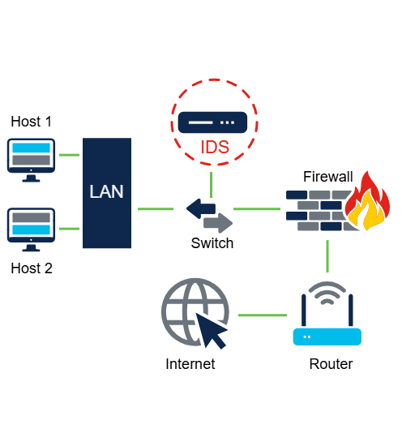
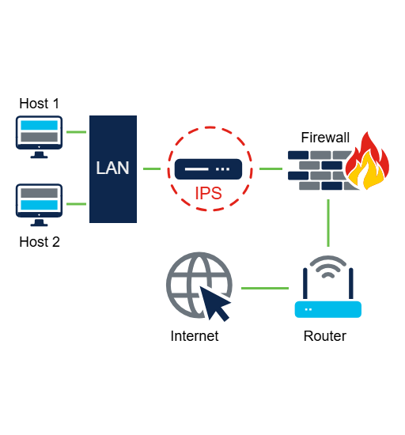

# Instrusion Detection and Prevention Systems

Intrusion detection systems (IDSs) and intrusion prevention systems (IPSs) are security measures deployed on a network to detect and prevent malicious activities.

## IDS

An IDS can either be a dedicated network device or one of several tools in a server, firewall or even a host computer operating system, such as Windows or Linux, that scans data against a database of rule or attack signatures, looking for malicious traffic.

An IDS (Intrusion Detection System) is like a security camera for your network.
It watches the data that moves through your network and looks for anything suspicious (like hacking attempts or known attack patterns).

## How does it work?

- The IDS doesn't sit directly in the path of network traffic.

- Instead, a copy of the data is sent to it using a switch (like a mirror).

- It then checks the data against a list of known threats (like virus or attack patterns).

- If it finds something suspicious, it will:

    - Log it

    - Alert the network admin

    - But NOT stop it — it's just watching, not acting.

## Why is it placed offline (not in the direct path)?

Because checking every packet of data takes time and can slow the network.

To avoid this delay, the IDS looks at a copy of the traffic not the real-time flow so your internet stays fast.

## Summary

IDS = Instrusion Detector, not a blocker.

It detects, logs, and alerts, but doesn't stop attacks.

It's placed offline to prevent slowing down the network.

# IPS

An IPS can block or deny traffic based on a positive rule or signature match. One of the most well-known IPS/IDS systems is Snort. The commercial version of Snort is Cisco's Sourcefire. Sourcefire can perform real-time traffic and port analysis, logging, content searching and matching, as well as detect probes, attacks and execute port scans. It also integrates with other third-party tools for reporting, performance and log analysis. 

An IPS (Intrusion Prevention System) is like a security guard — not only does it watch for threats like an IDS, but it can also block them right away if something dangerous is found.

## How does it works?

- It uses rules or attack signatures (like a list of known threats).

- If it detects something bad, it can:
    
    - Block the traffic

    - Deny access

    - Stop an attack in real time

## Snort and Sourcefire:

- Snort is one of the most popular IDS/IPS tools.

- Sourcefire is the commercial(paid, enterprise-level) version of Snort made by CISCO.

- Sourcefire can:
    
    - Analyze traffic and ports in real time

    - Search through data for threats

    - Detect scans, attacks and suspicious behavior

    - Work with other tools to report and analyze logs and performance

- Powerful tools used by professionals to protect networks.

