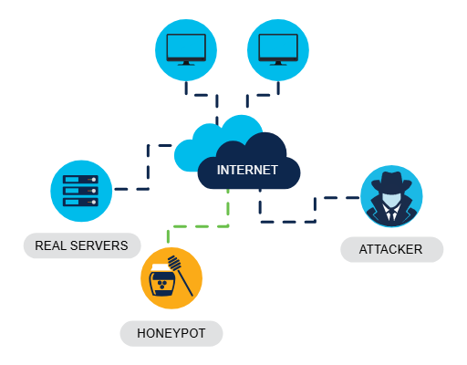

# Protecting your computing devices

Your computing devices are the portal to your online life, storing a lot of your personal data. Therefore, it’s important to protect the security of your devices.

Here are the first few steps to setup your device:

## Step1: Turn the firewall on

You should use at least one type of firewall (either a software firewall or a hardware firewall on a router) to protect your device from unauthorized access. The firewall should be turned on and constantly updated to prevent hackers from accessing your personal or organization data.

## Step2: Install antivirus and antispyware

To prevent spyware,worms or any other attacks you should only ever download software from trusted websites. However, you should always use antivirus software to provide another layer of protection. This software, which often includes antispyware, is designed to scan your computer and incoming email for viruses and delete them. Keeping your software up to date will protect your computer from any new malicious software that emerges.

## Step3: Manage your operating system and browser

 To protect your computer and your data, you should set the security settings on your computer and browser to medium level or higher. You should also regularly update your computer’s operating system, including your web browser, and download and install the latest software patches and security updates from the vendors.

 ## Step4: Set up password protection

 All of your computing devices, including PCs, laptops, tablets and smartphones, should be password protected to prevent unauthorized access. Any stored information, especially sensitive or confidential data, should be encrypted. You should only store necessary information on your mobile device, in case it is stolen or lost.

Remember, if any one of your devices is compromised, the criminals may be able to access all of your data through your cloud storage service provider, such as iCloud or Google Drive.

# Security Best Practices (In an organization)

1. Perform a risk assessment

Knowing and understanding the value of what you are protecting will help to justify security expenditures.

2. Create a security policy

Create a policy that clearly outlines the organization’s rules, job roles, and responsibilities and expectations for employees.

3. Physical security measures

Restrict access to networking closets and server locations, as well as fire suppression.

4. Human resources security measures

Background checks should be completed for all employees.

5. Perform and test backups

Back up information regularly and test data recovery from backups.

6. Maintain security patches and updates

Regularly update server, client and network device operating systems and programs.

7. Employ access controls

Configure user roles and privilege levels as well as strong user authentication.

8. Regularly test incident response

Employ an incident response team and test emergency response scenarios.

9. Implement a network monitoring, analytics and management tool

Choose a security monitoring solution that integrates with other technologies.

10. Implement network security devices

Use next generation routers, firewalls and other security appliances.

11. Implement a comprehensive endpoint security solution

Use enterprise level antimalware and antivirus software.

12. Encrypt data

Encrypt all sensitive organizational data, including email.

# Behavior-Based Security

Behavior-based security is a form of threat detection that involves capturing and analyzing the flow of communication between a user on the local network and a local or remote destination. Any changes in normal patterns of behavior are regarded as anomalies, and may indicate an attack.

## Honeypots

A honeypot is a behavior-based detection tool that lures the attacker in by appealing to their predicated pattern of malicious behavior.Once the attacker is inside the honeypot, the network administrator can capture, log and analyze their behavior so that they can build a better defense.

## Cisco's Cyber Threat Defense Solution Architecture

This security architecture uses behavior-based detection and indicators to provide greater visibility, contect and control. The aim is to know who is carrying out the attack they are performing and where, when and how the attack is taking place. This security architecture uses many security technologies to achieve the goal.