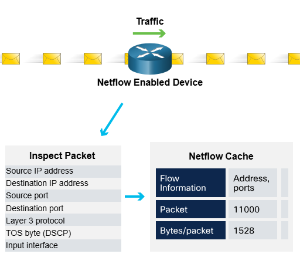

# Netflow

NetFlow is a network monitoring technology that tracks and analyzes data traffic flowing through devices like routers, switches, and firewalls.

## What does it do?
NetFlow collects detailed information like:

- Who is using the network (source IP)

- What they are accessing (destination IP)

- When they accessed it (timestamp)

- How they used the network (protocol, ports, etc.)

## Why is it useful?

- Helps understand normal behavior on the network.

- Can detect suspicious or unusual activity (e.g., an unknown IP suddenly sending a lot of data).

- Assists in behavior-based threat detection.

## How does it work?

- Devices (routers, switches, etc.) track data flows.

- This data is sent to a NetFlow collector a system that:

    - Stores the data

    - Analyzes patterns

    - Builds a profile of normal network activity

- If anything abnormal happens, it can raise an alert.

## Summary

NetFlow = Network traffic analyzer.
It tells you who is using your network, what they’re doing, when, and how.
It helps detect unusual behavior by comparing activity to what’s normal.