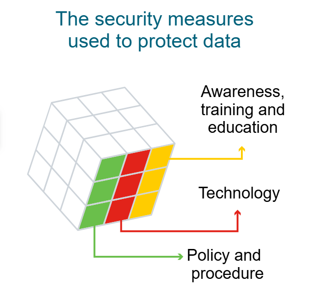

 Cybersecurity is the ongoing effort to protect individuals, organizations and governments from digital attacks by protecting networked systems and data from unauthorized use or harm.

There are three levels of protection:
1. Personal
On a personal level, you need to safeguard your identity, your data, and your computing devices.

2. Organizational
At an organizational level, it is everyone’s responsibility to protect the organization’s reputation, data and customers.

3. Government
As more digital information is being gathered and shared, its protection becomes even more vital at the government level, where national security, economic stability and the safety and wellbeing of citizens are at stake.

--Protecting Your Personal Data--
Personal data describes any information about you, including your name, social security number, driver license number, date and place of birth, your mother’s maiden name, and even pictures or messages that you exchange with family and friends.

Cybercriminals can use this sensitive information to identify and impersonate you, infringing on your privacy and potentially causing serious damage to your reputation.

---
## How hacker gets hands on your data?
1. Medical records
Every time you visit the doctor, personal information regarding your physical and mental health and wellbeing is added to your electronic health records (EHRs). Since the majority of these records are saved online, you need to be aware of the medical information that you share.

2. Education records
Educational records contain information about your academic qualifications and achievements. However, these records may also include your contact information, attendance records, disciplinary reports, health and immunization records as well as any special education records including individualized education programs (IEPs).

3. Employment and financial records
Employment data can be valuable to hackers if they can gather information on your past employment, or even your current performance reviews. Your financial records may include information about your income and expenditure. Your tax records may include paychecks, credit card statements, your credit rating and your bank account details. 
etc..

If you are on any social media or signing-up into a web-site:
When choosing a username, it’s important not to reveal any personal information. 

Some other useful tips to help you generate your username:

i. Don’t use your full name or parts of your address or phone number.
ii. Don’t use your email username.
iii. Don’t use the same username and password combination, especially on financial accounts.
iv. Don’t choose a super-odd username and then reuse it again and again — it makes you easier to track.
v. Don’t choose a username that gives clues to your passwords such as a series of numbers/letters, the first part of a two-part phrase, such as knock-knock or starlight, or the department in which you work, such as IT.
vi. Do choose a username that’s appropriate for the type of account, i.e., business, social or personal.

---
## How your data can be spread globally?
Only yesterday, you shared a couple of photos of your first day on the job with a few of your close friends. But that should be OK, right? But

Step 1: 
You took some photos at work on your mobile phone. Copies of these photos are now available on your mobile device.

Step 2:
You shared these with five close friends, who live in various locations across the world.

Step 3:
All of your friends downloaded the photos and now have copies of your photos on their devices.

Step 4:
One of your friends was so proud that they decided to post and share your photos online. The photos are no longer just on your device. They have in fact ended up on servers located in different parts of the world and people whom you don’t even know now have access to your photos.

---
## Who else wants your personal data?
1. Your Internet Service Provider(ISP)
Your ISP tracks your online activity and, in some countries, they can sell this data to advertisers for a profit.
In certain circumstances, ISPs may be legally required to share your information with government surveillance agencies or authorities.

2. Advertiser
Targeted advertising is part of the Internet experience. Advertisers monitor and track your online activities such as shopping habits and personal preferences and send targeted ads your way.

3. Social Engines and Social Media Platform
These platforms gather information about your gender, geolocation, phone number and political and religious ideologies based on your search histories and online identity. This information is then sold to advertisers for a profit.

4. Website you visit
Websites use cookies to track your activities in order to provide a more personalized experience. But this leaves a data trail that is linked to your online identity that can often end up in the hands of advertisers!

-----Organizational Data----
There are two main types of data that you should be aware of:
1. Traditional Data
Traditional data is typically generated and maintained by all organizations, big and small. It includes the following:

i. Transactional data such as details relating to buying and selling, production activities and basic organizational operations such as any information used to make employment decisions.

ii. Intellectual property such as patents, trademarks and new product plans, which allows an organization to gain economic advantage over its competitors. This information is often considered a trade secret and losing it could prove disastrous for the future of a company.

iii. Financial data such as income statements, balance sheets and cash flow statements, which provide insight into the health of a company.

2. Internet Of Things(IOT) and Big Data
IoT is a large network of physical objects, such as sensors, software and other equipment. All of these ‘things’ are connected to the Internet, with the ability to collect and share data. And given that storage options are expanding through the cloud and virtualization, it’s no surprise that the emergence of IoT has led to an exponential growth in data, creating a new area of interest in technology and business called 'Big Data.'

---

## The Cube ( John McCumber -1991 )
The McCumber Cube is a model framework to help organizations establish and evaluate information security initiatives by considering all of the related factors that impact them. This security model has three dimensions:

1. The foundational principles for protecting information systems.
2. The protection of information in each of its possible states.
3. The security measures used to protect data. 

i. Confidentiality is a set of rules that prevents sensitive information from being disclosed to unauthorized people, resources and processes. Methods to ensure confidentiality include data encryption, identity proofing and two factor authentication.

ii. Integrity ensures that system information or processes are protected from intentional or accidental modification. One way to ensure integrity is to use a hash function or checksum.

iii. Availability means that authorized users are able to access systems and data when and where needed and those that do not meet established conditions, are not. This can be achieved by maintaining equipment, performing hardware repairs, keeping operating systems and software up to date, and creating backups.

i. Processing refers to data that is being used to perform an operation such as updating a database record (data in process).

ii. Storage refers to data stored in memory or on a permanent storage device such as a hard drive, solid-state drive or USB drive (data at rest).

iii. Transmission refers to data traveling between information systems (data in transit).

i. Awareness, training and education are the measures put in place by an organization to ensure that users are knowledgeable about potential security threats and the actions they can take to protect information systems.

ii. Technology refers to the software- and hardware-based solutions designed to protect information systems such as firewalls, which continuously monitor your network in search of possible malicious incidents.

iii. Policy and procedure refers to the administrative controls that provide a foundation for how an organization implements information assurance, such as incident response plans and best practice guidelines.

## Data Security Breaches

The Persirai botnet
In 2017, an IoT botnet, Persirai, targeted over 1000 different models of IP cameras, accessing open ports to inject a command that forced the cameras to connect to a site which installed malware on them. Once the malware was downloaded and itself and was therefore able to run in memory to avoid detection.

Over 122,000 of these cameras from several different manufacturers were hijacked and used to carry out distributed denial-of-service (DDoS) attacks, without the knowledge of thier owners. A DDoS attack occurs when multiple devices infected with malware flood the resources of a targeted system.

The IoT is connecting more and more devices, creating more opportunities for cybercriminals to attack.

---
## Concequence of Security breach
1. Reputation Damange
A security breach can have a negative long-term impact on an organization’s reputation that has taken years to build. Customers, particularly those who have been adversely affected by the breach, will need to be notified and may seek compensation and/or turn to a reliable and secure competitor. Employees may also choose to leave in light of a scandal.

2. Vandalism
A hacker or hacking group may vandalize an organization’s website by posting untrue information. They might even just make a few minor edits to your organization’s phone number or address, which can be trickier to detect.
In either case, online vandalism can portray unprofessionalism and have a negative impact on your organization’s reputation and credibility.

3. Theft
A data breach often involves an incident where sensitive personal data has been stolen. Cybercriminals can make this information public or exploit it to steal an individual’s money and/or identity.

4. Loss of revenue
The financial impact of a security breach can be devastating. For example, hackers can take down an organization’s website, preventing it from doing business online. A loss of customer information may impede company growth and expansion. It may demand further investment in an organization’s security infrastructure. And let’s not forget that organizations may face large fines or penalties if they do not protect online data.

5. Damaged Intellectual Property
A security breach could also have a devastating impact on the competitiveness of an organization, particularly if hackers are able to get their hands on confidential documents, trade secrets and intellectual property.

---
# What's Exploit?
An exploit is like a hack that breaks into a system by using its flaws.

# Scenario 1 (Hotel Info)
According to our sources, a well known hotel chain that operates across the world has reported a massive data breach, with the personal information of over three million guests exposed to hackers.

The hotel discovered that hackers gained access to its customer database by using the login details of one of its employees.

At this point, the hotel doesn’t believe that the hackers were able to access any account passwords or financial information. Recent guests are encouraged to check the hotel chain’s web portal to see if they have been impacted by this breach.

# Scenario 2 (E-learning platform)
A popular online training platform admitted leaving the personal data of millions of its students (many of them minors) exposed on a publicly accessible cloud database.

Hackers were able to directly access students’ full names, email addresses, phone numbers, and school enrollment details from the Internet!

While it’s unclear what the hackers have done with this acquired information, it’s safe to say that they have everything they need to carry out widespread phishing or malware attacks.

In both cases, the organizations need to invest in improved security practices.

This might include:

i. investing in cybersecurity training for all staff so that they are aware of and able to spot a cyber attack
ii. enforcing two factor authentication for employees accessing files and applications that contain sensitive data
iii. maintaining log files and ongoing monitoring to identify anomalous behavior that might indicate a data breach
iv. storing the passwords of customers using a combination of salting and robust hashing algorithms
v. separating cloud-based resources from the public Internet into an isolated private network segment
vi. granting employee access to personal data and internal systems only via a secure VPN connection.

## Types of Attackers
Let’s look at some of the main types of cyber attackers who’ll try anything to get their hands on our information. They are often categorized as white hat, gray hat or black hat attackers.

1. Amateurs
The term 'script kiddies' emerged in the 1990s and refers to amateur or inexperienced hackers who use existing tools or instructions found on the Internet to launch attacks. Some script kiddies are just curious, others are trying to demonstrate their skills and cause harm. While script kiddies may use basic tools, their attacks can still have devastating consequences.

2. Hackers
This group of attackers break into computer systems or networks to gain access. Depending on the intent of their break in, they can be classified as white, gray or black hat hackers.

i. White hat attackers break into networks or computer systems to identify any weaknesses so that the security of a system or network can be improved. These break-ins are done with prior permission and any results are reported back to the owner.

ii. Gray hat attackers may set out to find vulnerabilities in a system but they will only report their findings to the owners of a system if doing so coincides with their agenda. Or they might even publish details about the vulnerability on the internet so that other attackers can exploit it.

iii. Black hat attackers take advantage of any vulnerability for illegal personal, financial or political gain.

White hat attackers aim to discover security weaknesses so that they can be improved, whereas black hat attackers take advantage of any vulnerabilities for illegal personal, financial or political gain. Gray hat attackers are somewhere in between. While they may not have malicious intentions, they want to get something for their discovery.

3. Organized hackers
These attackers include organizations of cyber criminals, hacktivists, terrorists and state-sponsored hackers. They are usually highly sophisticated and organized, and may even provide cybercrime as a service to other criminals.

Hacktivists make political statements to create awareness about issues that are important to them.

State-sponsored attackers gather intelligence or commit sabotage on behalf of their government. They are usually highly trained and well-funded and their attacks are focused on specific goals that are beneficial to their government.

# Internal and External Threats
1. Internal 
Employees, contract staff or trusted partners can accidentally or intentionally:
i. mishandle confidential data
ii. facilitate outside attacks by connecting infected USB media into the organination's computer system
iii. invite malware onto the organization's network by clicking on malicious emails or website
iv. threaten the operations of internal servers or network infastructure devices.

2. External
Amateurs or skilled attackers outside of the organization can:
i. exploit vulnerabilities in the network
ii. gain unauthorized access to computing devices
iii. use social engineering to gain unauthorized access to organizational data.

---
## Cyberwarfare
Cyberwarfare, as its name suggests, is the use of technology to penetrate and attack another nation’s computer systems and networks in an effort to cause damage or disrupt services, such as shutting down a power grid.

# Purpose of Cyberwarfare
The main reason for resorting to cyberwarfare is to gain advantage over adversaries, whether they are nations or competitors.
1. To gather compromised information and/or defense secrets
A nation or international organization can engage in cyberwarfare in order to steal defense secrets and gather information about technology that will help narrow the gaps in its industries and military capabilities.

Furthermore, compromised sensitive data can give attackers leverage to blackmail personnel within a foreign government.

2. To impact another nation’s infrastructure
Besides industrial and military espionage, a nation can continuously invade another nation’s infrastructure in order to cause disruption and chaos.

For example, a cyber attack could shut down the power grid of a major city. Consider the consequences if this were to happen; roads would be congested, the exchange of goods and services would be halted, patients would not be able to get the care they would need if an emergency occurred, access to the internet would be interrupted. By shutting down a power grid, a cyber attack could have a huge impact on the everyday life of ordinary citizens.

foreg:
Stuxnet is one of the most sophisticated and dangerous computer worms ever discovered. It was designed to sabotage Iran's nuclear program and is widely believed to be the first cyber weapon created to cause physical damage to critical infrastructure.

i. It targeted industrial control systems (ICS), specifically Siemens PLCs (Programmable Logic Controllers).

ii. It was designed to disrupt uranium enrichment at Iran’s Natanz nuclear facility by spinning centrifuges out of control.

# How Did It Work?
i. Infection via USB
Spread through USB drives, allowing it to enter air-gapped (offline) systems.

ii. Exploiting Zero-Day Vulnerabilities
Used four Windows zero-day vulnerabilities, extremely rare for malware.

iii. Targeted Specific Hardware
Once inside, it searched for specific Siemens Step7 systems connected to centrifuge controllers.

iv. Manipulated Equipment Stealthily
It sent fake signals to the monitoring software so that engineers saw normal values, even as the machines were being damaged.

# Lessons for Cybersecurity:
i. Air-gapped systems aren't 100% safe.

ii. ICS/SCADA systems need strong security.

iii. Nation-state attacks are real and capable of cyber-physical destruction.

iv. Importance of patching vulnerabilities, especially in critical infrastructure.