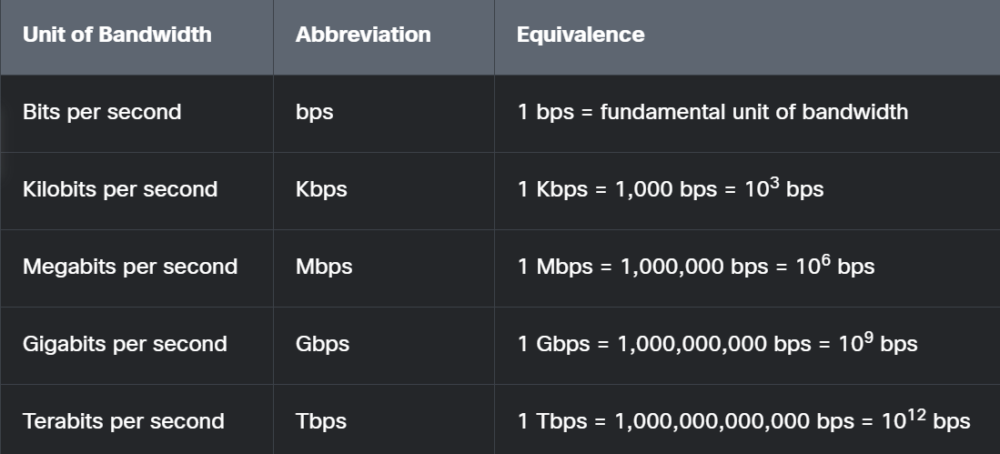

# Bandwidth

Bandwidth refers to the maximum amount of data that can be transferred over a network connection in a given amount of time. 

It is usually measured in bits per second (bps), commonly seen as Mbps (megabits per second) or Gbps (gigabits per second).

## Important points

1. Bandwidth ≠ Speed:

Bandwidth is about capacity, not how fast the data travels.
(Speed is affected by latency and network congestion.)

2. High bandwidth means:

- Faster downloads/uploads

- Better video streaming quality

- Smoother video calls

- Better performance with many devices 

## Types of Bandwidth

1. Network Bandwidth: between devices or across the internet

2. Application Bandwidth: How much data a specific app uses (eg. Zoom, YouTube)

3. User Bandwith: How much your ISP allocated to you

