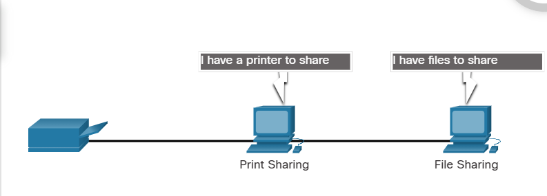

Client and server software usually run on separate computers, but it is also possible for one computer to run both client and server software at the same time. In small businesses and homes, many computers function as the servers and clients on the network. This type of network is called a peer-to-peer (P2P) network.

The simplest P2P network consists of two directly connected computers using either a wired or wireless connection. Both computers are then able to use this simple network to exchange data and services with each other, acting as either a client or a server as necessary.

Multiple PCs can also be connected to create a larger P2P network, but this requires a network device, such as a switch, to interconnect the computers.

The main disadvantage of a P2P environment is that the performance of a host can be slowed down if it is acting as both a client and a server at the same time. The figure lists some of the advantages and disadvantages of peer-to-peer networks.
In larger businesses, because of the potential for high amounts of network traffic, it is often necessary to have dedicated servers to support the number of service requests.

The advantages of P2P netweorking:
1. Easy to set up
2. Less complex
3. Lower cost because network devices and dedicated servers may not be required
4. Can be used for simple tasks such as trandferring files and sharing printers

The disadvantages of P2P networking:
1. No centralized administration
2. Not as secure
3. Not scalable
4. All devices may act as both clients and servers which can slow their performance

## P2P Applications
A P2P application allows a device to act as both a client and a server within the same communication, as shown in the figure. In this model, every client is a server and every server is a client. P2P applications require that each end device provide a user interface and run a background service.

Some P2P applications use a hybrid system where resource sharing is decentralized, but the indexes that point to resource locations are stored in a centralized directory. In a hybrid system, each peer accesses an index server to get the location of a resource stored on another peer.