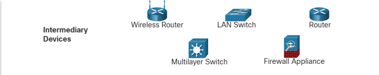

The path that a message takes from its source to destination can be as simple as a single cable connecting one computer to another, or as complex as a network that literally spans the globe. This network infrastructure is the platform that supports the network. It provides the stable and reliable channel over which our communications can occur.

The network infrastructure contains three categories of hardware components, as shown in the figure:

1. End devices

2. Intermediate devices

3. Network media

Devices and media are the physical elements, or hardware, of the network. Hardware is often the visible components of the network platform such as a laptop, PC, switch, router, wireless access point, or the cabling used to connect the devices. Occasionally, some components may not be so visible. In the case of wireless media, messages are transmitted through the air using invisible radio frequencies or infrared waves.