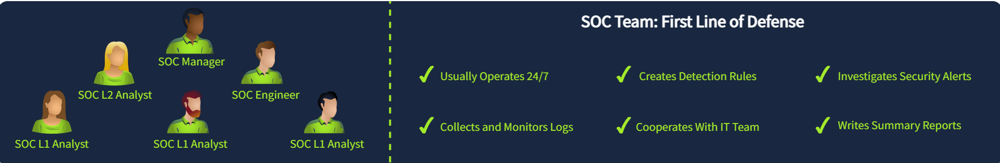
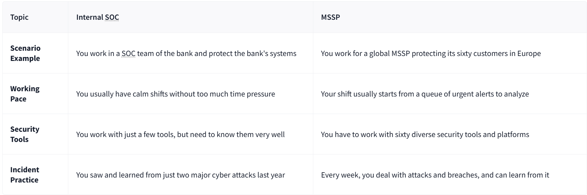

Blue Team is about defensive security, meaning it constantly monitors for attacks and tries to respond to them quickly. Depending on a company's size and sector, Blue Team can include a lot of different roles and subdepartments, usually counting 3 to 50 members total. Now, let's explore the most common Blue Team departments.

SOC is the central hub for an organization's cyber security - they are the first line of defense, work with various alerts, and handle most attacks. You can read more about SOC structure in this room, but an efficient SOC is usually composed of the following roles:

L1 Analysts: Junior members who triage alerts and pass complex cases to L2
L2 Analysts: Experienced members who investigate more advanced attacks
Engineers: Experts in configuring security tools like EDR or SIEM
Manager: A person who manages the whole SOC team

## Internal SOC vs MSSP

